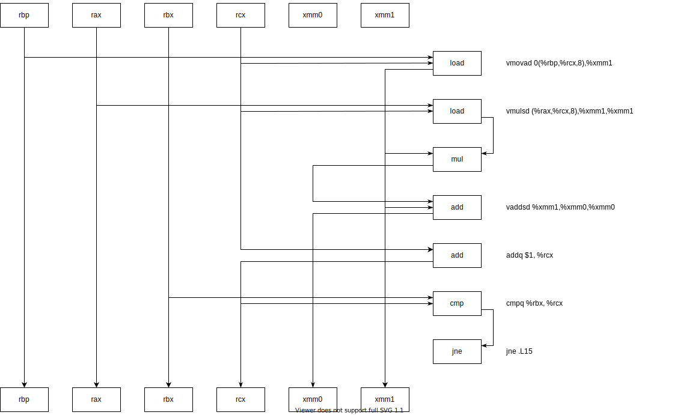
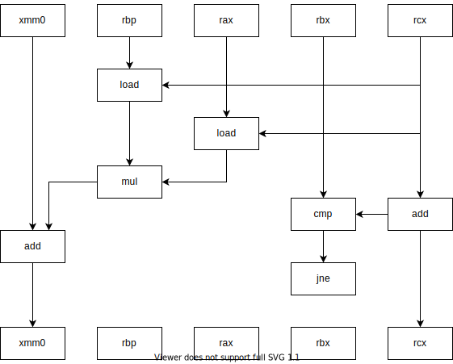

CSED211 Homework 3
===

20190084 권민재

# 1. Exercise 3.69
You are charged with maintaining a large C program, and you come across the
following code:
```c
typedef struct {
    int first;
    a_struct a[CNT];
    int last;
} b_struct;

void test(long i, b_struct *bp)
{
    int n = bp->first + bp->last;
    a_struct *ap = &bp->a[i];
    ap->x[ap->idx] = n;
}
```

The declarations of the compile-time constant CNT and the structure a_struct
are in a file for which you do not have the necessary access privilege. Fortunately,
you have a copy of the .o version of code, which you are able to disassemble with
the objdump program, yielding the following disassembly:

```asm
# void test(long i, b_struct *bp)
# i in %rdi, bp in %rsi
0000000000000000 <test>:
     0: 8b 8e 20 01 00 00   mov 0x120(%rsi),%ecx # ecx = *(bp + 288)
     6: 03 0e               add (%rsi),%ecx # ecx = (*(bp + 288)) + *bp => n
     8: 48 8d 04 bf         lea (%rdi,%rdi,4),%rax # rax = 5i
     c: 48 8d 04 c6         lea (%rsi,%rax,8),%rax # rax = bp + 40i
    10: 48 8b 50 08         mov 0x8(%rax),%rdx # rdx = *(bp + 40i + 8)
    14: 48 63 c9            movslq %ecx,%rcx
    17: 48 89 4c d0 10      mov %rcx,0x10(%rax,%rdx,8) # *(bp + 40i + 8*(*(bp + 40i + 8)) + 16)
    1c: c3                  retq
```
Using your reverse engineering skills, deduce the following:

## A. The value of CNT
### Solution
```asm
lea (%rdi,%rdi,4),%rax # rax = 5i
lea (%rsi,%rax,8),%rax # rax = bp + 40i
```
`i`가 40바이트 단위로 설정되므로, `a_struct`는 40 바이트일 것으로 추정할 수 있다.
```asm
mov 0x120(%rsi),%ecx # ecx = *(bp + 288)
add (%rsi),%ecx      # ecx = (*(bp + 288)) + *bp
```
bp->first가 bp, bp->last가 bp+288에 존재하므로 둘 사이에 284바이트가 존재하는 것을 알 수 있고, 메모리 alignment를 생각해 보았을 때, $\mathbf{CNT} = 280 \div 40 = 7$이라고 생각할 수 있다.

### Answer
7

## B. A complete declaration of structure `a_struct`. Assume that the only fields in this structure are `idx` and `x`, and that both of these contain signed values.
### Solution
```asm
mov 0x8(%rax),%rdx
movslq %ecx,%rcx
mov %rcx,0x10(%rax,%rdx,8)
```
`mov 0x8(%rax),%rdx`에서, `ap->idx`가 `ap+8`에 존재하는 정수 자료형임을 알 수 있고 (배열의 인덱스로 사용되므로), `mov %rcx,0x10(%rax,%rdx,8)`에서, `ap->x`는 `ap+0x10`부터 존재하는 8바이트 단위의 배열임을 알 수 있다.
`a_struct`의 크기가 40바이트 이므로, ap->x의 크기는 $40-16=24$로 추정할 수 있므로, 여기서 배열에 8바이트 자료형이 3번 들어갈 수 있다는 것을 알 수 있다.
### Answer
```c
typedef struct {
    long idx;
    long x[3];
} a_struct;
```

# 2. Exercise 3.72
Figure 3.54(a) shows the code for a function that is similar to function `vfunct` (Figure 3.43(a)). We used `vfunct` to illustrate the use of a frame pointer in managing variable-size stack frames. The new function `aframe` allocates space for local array `p` by calling library function `alloca`. This function is similar to the more commonly used function `malloc`, except that it allocates space on the run-time stack. The space is automatically deallocated when the executing procedure returns. Figure 3.54(b) shows the part of the assembly code that sets up the frame pointer and allocates space for local variables `i` and `p`. It is very similar to the corresponding code for `vframe`. Let us use the same notation as in Problem 3.49: The stack pointer is set to values $s_1$ at line 4 and $s_2$ at line 7. The start address of array `p` is set to value $p$ at line 9. Extra space $e_2$ may arise between $s_2$ and $p$, and extra space $e_1$ may arise between the end of array `p` and $s_1$.

(a) C code
```c
#include <alloca.h>

long aframe(long n, long idx, long *q) {
    long i;
    long **p = alloca(n * sizeof(long *));
    p[0] = &i;
    for (i = 1; i < n; i++)
        p[i] = q;
    return *p[idx];
 }
```
(b) Portions of generated assembly code
```asm
# long aframe(long n, long idx, long *q)
# n in %rdi, idx in %rsi, q in %rdx
aframe:
    pushq %rbp
    movq %rsp, %rbp
    subq $16, %rsp            # Allocate space for i (%rsp = s1)
    leaq 30(,%rdi,8), %rax
    andq $-16, %rax
    subq %rax, %rsp           # Allocate space for array p (%rsp = s2)
    leaq 15(%rsp), %r8
    andq $-16, %r8            # Set %r8 to &p[0]
    # ...
```
## A. Explain, in mathematical terms, the logic in the computation of $s_2$.
### Solution
```asm
leaq 30(,%rdi,8), %rax    # rax = n * 8 + 30
andq $-16, %rax           # rax = (n * 8 + 30) & 0xFFFFFFF0, rax의 값이 16 이상 239 이하 임을 보장하는 동시에, 메모리 얼라인을 맞춘다.
subq %rax, %rsp           # s2 = s1 - ((n * 8 + 30) & 0xFFFFFFF0)
```
### Answer

$s_2 = s_1 - ((n \times 8 + 30) \;\&\; \mathrm{0xFFFFFFF0})$
## B. Explain, in mathematical terms, the logic in the computation of $p$.

### Solution

```asm
leaq 15(%rsp), %r8        # r8 = rsp + 15
andq $-16, %r8            # r8 = (rsp + 15) & 0xFFFFFFF0, r8의 값이 16 이상 239 이하 임을 보장하는 동시에, 메모리 얼라인을 맞춘다.
```

### Answer

$p = (s_2 + 15) \;\&\; \mathrm{0xFFFFFFF0}$

## C. Find values of $n$ and $s_1$ that lead to minimum and maximum values of $e_1$.

> *Note.*
>
> $e_1 = s_1 - s_2 - n \times 8$ 

### Minimum

$n$이 짝수일 때, $s_2 = s_1 - (n \times 8 + 16)$이므로, $n$ 이 짝수이기만 하면 $s_1$의 값에 상관 없이 최솟값은 16이다.

**Answer**   $n$: 짝수, $s_1$: 상관 없음, $e_1$: 16

### Maximum

$n$이 홀수일 때, $s_2 = s_1 - (n \times 8 + 24)$이므로, $n$ 이 홀수이기만 하면 $s_1$의 값에 상관 없이 최댓값은 16이다.

**Answer**  $n$: 홀수, $s_1$: 상관 없음, $e_1$: 24

## D. What alignment properties does this code guarantee for the values of $s_2$ and $p$?
# 3. Exercise 5.13

Suppose we wish to write a procedure that computes the inner product of two vectors `u` and `v`. An abstract version of the function has a CPE of 14–18 with x86- 64 for different types of integer and floating-point data. By doing the same sort of transformations we did to transform the abstract program `combine1` into the more efficient `combine4`, we get the following code:

```c
/* Inner product. Accumulate in temporary */
void inner4(vec_ptr u, vec_ptr v, data_t *dest){
    long i;
    long length = vec_length(u);
    data_t *udata = get_vec_start(u);
    data_t *vdata = get_vec_start(v);
    data_t sum = (data_t) 0;
    
    for (i = 0; i < length; i++) {
        sum = sum + udata[i] * vdata[i];
    }
    *dest = sum;
}
```

Our measurements show that this function has CPEs of 1.50 for integer data and 3.00 for floating-point data. For data type double, the x86-64 assembly code for the inner loop is as follows:

```asm
# Inner loop of inner4. data_t = double, OP = *
# udata in %rbp, vdata in %rax, sum in %xmm0
# i in %rcx, limit in %rbx
.L15:                                       # loop:
    vmovsd 0(%rbp,%rcx,8), %xmm1            # Get udata[i]
    vmulsd (%rax,%rcx,8), %xmm1, %xmm1      # Multiply by vdata[i]
    vaddsd %xmm1, %xmm0, %xmm0              # Add to sum
    addq $1, %rcx                           # Increment i
    cmpq %rbx, %rcx                         # Compare i:limit
    jne .L15                                # If !=, goto loop
```

Assume that the functional units have the characteristics listed in Figure 5.12.

## A. Diagram how this instruction sequence would be decoded into operations and show how the data dependencies between them would create a critical path of operations, in the style of Figures 5.13 and 5.14.





## B. For data type `double`, what lower bound on the CPE is determined by the critical path?
floating-point add 연산에 의해 결정되며, 이것의 CPE는 3.0이다. 
## C. Assuming similar instruction sequences for the integer code as well, what lower bound on the CPE is determined by the critical path for integer data?
Integer-add 연산에 의해 결정되며, 이것의 CPE는 1.0이다.
## D. Explain how the floating-point versions can have CPEs of 3.00, even though the multiplication operation requires 5 clock cycles.
L15가 `n`번 반복할 때 mul 연산은 `n`번 수행하는 반면, add 연산은 `2n` 번 수행한다. $5 \times n < 3 \times 2n$이기 때문에, `add` 연산이 더 critical 한 연산이다.
# 4. Exercise 5.17
The library function memset has the following prototype:

`void *memset(void *s, int c, size_t n);`

This function fills n bytes of the memory area starting at s with copies of the low- order byte of c. For example, it can be used to zero out a region of memory by giving argument 0 for c, but other values are possible.
The following is a straightforward implementation of memset:
```c
/* Basic implementation of memset */
void *basic_memset(void *s, int c, size_t n) {
    size_t cnt = 0;
    unsigned char *schar = s;
    while (cnt < n){
        *schar++ = (unsigned char) c;
        cnt++;
    }
    return s;
}
```

Implement a more efficient version of the function by using a word of data type unsigned long to pack eight copies of c, and then step through the region using word-level writes. You might find it helpful to do additional loop unrolling as well. On our reference machine, we were able to reduce the CPE from 1.00 for the straightforward implementation to 0.127. That is, the program is able to write 8 bytes every clock cycle.
## Answer
```c
void *memset(void *s, int c, size_t n) {
    size_t cnt = 0;
    unsigned char *schar = s;
    unsigned long *slong;
    unsigned long clong;
    while (cnt < n){
        *schar++ = (unsigned char) c;
        cnt++;
        
        if(cnt == 8){
            clong = *((unsigend long *)s);
            slong = (unsigned long *) schar;
            while((n-cnt) >= 8){
                *slong++ = clong;
                cnt+=8;
            }
            schar = slong;
        }
    }
    return s;
}
```
# 5. Exercise 5.19
In Problem 5.12, we were able to reduce the CPE for the prefix-sum computation to 3.00, limited by the latency of floating-point addition on this machine. Simple loop unrolling does not improve things. 
Using a combination of loop unrolling and reassociation, write code for a prefix sum that achieves a CPE less than the latency of floating-point addition on your machine. Doing this requires actually increasing the number of additions performed. For example, our version with two-way unrolling requires three ad- ditions per iteration, while our version with four-way unrolling requires five. Our best implementation achieves a CPE of 1.67 on our reference machine.
Determine how the throughput and latency limits of your machine limit the minimum CPE you can achieve for the prefix-sum operation.
## Answer
```c
void psum1a(float a[], float p[], long n){
    long i;
    /* last_val holds p[i-1]; val hods p[i] */
    float last_val, val;
    float e0, e1, e2, e3;
    last_val = p[0] = a[0];
    for (i = 1; i < n - 4; i+=4) {
        p[i] = e0 = last_val + a[i];
        p[i+1] = e1 = e0 + a[i+1];
        p[i+2] = e2 = e1 + a[i+2];
        p[i+3] = e3 = e2 + a[i+3];
        last_val = e3;
    }
    
    for(; i < n; i++){
        p[i] = last_val = (last_val + a[i]);
    }
}
```
# 6. Exercise 6.24